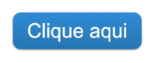

<h1 align="center"></h1>

  <a href="#-Deployment">Deployment</a>&nbsp;&nbsp;|&nbsp;&nbsp;
  <a href="#-Tecnologias">Tecnologias</a>&nbsp;&nbsp;|&nbsp;&nbsp;
  <a href="#-Projeto">Projeto</a>&nbsp;&nbsp;|&nbsp;&nbsp;
  <a href="#-Layout">Layout</a>&nbsp;&nbsp;&nbsp;&nbsp;

## 🌐 Deployment

Você pode visualizar o deploy do projeto através desse link:
 🟢[GitHub Pages](https://carecsnay.github.io/button-clone/) 

## 🚀 Tecnologias

Esse projeto foi desenvolvido com as seguintes tecnologias:

- HTML5 
- CSS3

## 💻 Projeto

Exercício proposto pela B7Web para testar conhecimentos de HTML5 e CSS3

## 🔖 Layout
  

    
  

---

Todos os direitos reservados.